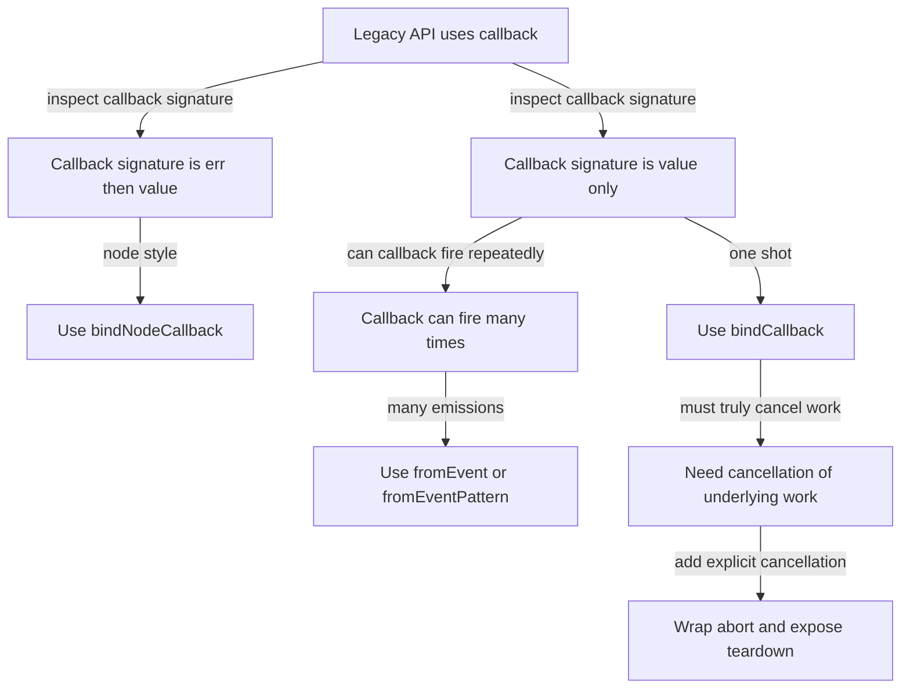

# 002 — bindCallback (Creation Operator)

## What it is
`bindCallback` converts a **single-shot callback function** into a function that returns an **Observable**.

- Input: `fn(...args, callback)` where `callback` is called like `callback(result)` or `callback(a, b, c)`.
- Output: `(...args) => Observable<result>` that:
  - calls `fn` **on subscribe**,
  - emits **exactly once** (the callback arguments),
  - then **completes**.

> If your callback is **Node-style** (`(err, value)`), use `bindNodeCallback` instead.

---

## BehaviorIntent
Turn a callback-based API into a cold, one-shot Observable factory.

## BehaviorQualifier
Cold • one-shot • emits once • completion immediately after first callback invocation • no built-in error-first convention.

---

## TagSpec (Type-Shape + Policy Behaviors)

### Type-Shape
```ts
bindCallback<A extends unknown[], R extends unknown[]>(
  func: (...args: [...A, (...cbArgs: R) => void]) => unknown,
  resultSelector?: (...cbArgs: R) => unknown
): (...args: A) => Observable<unknown>
```

### Policy Behaviors
- **Cold**: `func` is invoked per subscription (unless you share).
- **One-shot**: the resulting Observable is designed for callbacks invoked once.
- **Multi-arg callback**: if the callback provides multiple values, the emission is **an array** of those values (unless `resultSelector` is used).
- **Error handling**: there is **no** built-in “error-first” interpretation; any error policy must be modeled explicitly (preferably as data).

---

## 6 Rules

### Start rule
- On `subscribe`, call `func(...args, cb)`.

### Emit rule
- When `cb` is invoked the first time, emit:
  - the single value if it is one argument, or
  - an array of values if multiple arguments, or
  - the `resultSelector(...cbArgs)` result if provided.

### State rule
- After the first callback invocation, the Observable transitions to a terminal phase.

### Completion rule
- After emitting, complete immediately.

### Cancellation rule
- If unsubscribed **before** the callback is called, no value is emitted.
- Unsubscription does **not** automatically cancel the underlying side effect started by `func` (unless `func` itself supports cancellation).

### Error rule
- If `func` throws synchronously at subscription time, the Observable errors.
- Prefer converting errors to data at the boundary (see use cases).

---

## Operational Semantics (plain if/then)
Let `σ = { phase: Idle | Active | Completed | Cancelled, subscribed: boolean }`.

- On `subscribe` when `σ.phase = Idle`:
  - set `σ.phase := Active`
  - call `func(...args, cb)`

- On `cb(...cbArgs)` when `σ.phase = Active` and subscription is not cancelled:
  - emit `result(cbArgs)`
  - set `σ.phase := Completed`
  - complete

- On `unsubscribe` when `σ.phase = Active`:
  - set `σ.phase := Cancelled`

- On synchronous throw during `func(...args, cb)`:
  - error

---

## Invariants
1) **Invariant: At most one `next` is delivered.**
   Plain: You will never receive more than one emitted value from a `bindCallback` Observable.

2) **Invariant: Completion happens immediately after the first emission.**
   Plain: Once the callback produces a value, the stream completes right away.

3) **Invariant: The underlying function is invoked only on subscribe.**
   Plain: Creating the Observable does not run the callback API—subscribing does.

---

# 5 Use Cases (with TypeScript)

All examples model failures as **data** (`Result`) and keep side effects at the **subscribe boundary**.

## Shared helpers (used in the examples)
```ts
type Result<E, A> = { _tag: 'Ok'; value: A } | { _tag: 'Err'; error: E };
const Ok = <A>(value: A): Result<never, A> => ({ _tag: 'Ok', value });
const Err = <E>(error: E): Result<E, never> => ({ _tag: 'Err', error });

const render = (label: string) => (value: unknown) => {
  // Side effect at the subscribe boundary
  console.log(label, value);
};
```

---

## 1) bindCallback — When the user wraps a one-shot callback API, do “call on subscribe” and emit the result once.

**Scenario**: A legacy API loads a user and calls `cb(user)` exactly once.

```ts
import { bindCallback } from 'rxjs';
import { map } from 'rxjs/operators';

type User = { id: string; name: string };

declare function loadUserLegacy(id: string, cb: (u: User) => void): void;

const loadUser$ = bindCallback(loadUserLegacy);

const program = (id: string) =>
  loadUser$(id).pipe(
    map((u) => Ok(u))
  );

program('u-1').subscribe(render('UC1'));
```

**Key behavior**: calling `loadUser$('u-1')` is pure; the legacy function runs only when you subscribe.

---

## 2) bindCallback — When the callback returns multiple values, do “collect cb args” and emit them as one array.

**Scenario**: A measurement API calls `cb(width, height)`.

```ts
import { bindCallback } from 'rxjs';
import { map } from 'rxjs/operators';

declare function measureLegacy(cb: (w: number, h: number) => void): void;

const measure$ = bindCallback(measureLegacy);

type Size = { w: number; h: number };

const program = () =>
  measure$().pipe(
    map(([w, h]) => Ok<Size>({ w, h }))
  );

program().subscribe(render('UC2'));
```

**Key behavior**: because the callback has 2 args, the emission is `[w, h]`.

---

## 3) bindCallback — When the user wants a domain-shaped value, do “resultSelector” and emit the mapped result.

**Scenario**: Same `cb(width, height)` API, but you want `Size` directly.

```ts
import { bindCallback } from 'rxjs';
import { map } from 'rxjs/operators';

type Size = { w: number; h: number };

declare function measureLegacy(cb: (w: number, h: number) => void): void;

const measureSize$ = bindCallback(measureLegacy, (w: number, h: number): Size => ({ w, h }));

const program = () =>
  measureSize$().pipe(
    map((size) => Ok(size))
  );

program().subscribe(render('UC3'));
```

**Why this matters**: `resultSelector` centralizes the “shape conversion” at the boundary.

---

## 4) bindCallback — When the legacy API can fail, do “model failure in the callback payload” and emit `Result`.

**Scenario**: The legacy API calls the callback with an explicit outcome object instead of throwing.

```ts
import { bindCallback } from 'rxjs';
import { map } from 'rxjs/operators';

type LegacyOutcome =
  | { ok: true; value: string }
  | { ok: false; error: 'NETWORK' | 'NOT_FOUND' };

declare function readSettingLegacy(key: string, cb: (outcome: LegacyOutcome) => void): void;

const readSetting$ = bindCallback(readSettingLegacy);

const program = (key: string) =>
  readSetting$(key).pipe(
    map((outcome) =>
      outcome.ok ? Ok(outcome.value) : Err(outcome.error)
    )
  );

program('theme').subscribe(render('UC4'));
```

**Key behavior**: failures remain values; the Observable stays in the “data plane,” not the “error channel.”

---

## 5) bindCallback — When multiple subscribers need the same one-shot result, do “shareReplay” to avoid re-running the callback API.

**Scenario**: `loadConfigLegacy(cb)` is expensive and you want it executed once and replayed.

```ts
import { bindCallback } from 'rxjs';
import { map, shareReplay } from 'rxjs/operators';

type Config = { apiBaseUrl: string };

declare function loadConfigLegacy(cb: (cfg: Config) => void): void;

const loadConfigOnce$ = bindCallback(loadConfigLegacy)().pipe(
  map((cfg) => Ok(cfg)),
  shareReplay({ bufferSize: 1, refCount: true })
);

loadConfigOnce$.subscribe(render('UC5-A'));
loadConfigOnce$.subscribe(render('UC5-B'));
```

**Key behavior**: without sharing, each subscription would call `loadConfigLegacy` again.

---

## Common pitfalls
- Using `bindCallback` for Node-style APIs (`(err, value)`)—use `bindNodeCallback`.
- Expecting cancellation to stop the underlying work—unsubscription only stops delivery.
- Forgetting that multi-arg callbacks emit arrays unless `resultSelector` is used.

---

# Use Case Explorer and Specialization Decision Tree

## Use-case index
| Need | Prefer | Operator choice |
|---|---|---|
| Wrap callback called once with cb(value) | single emission + completion | `bindCallback` |
| Wrap Node-style cb(err, value) | error-first convention | `bindNodeCallback` |
| Wrap event-like callbacks called many times | multi-emission over time | `fromEvent` / `fromEventPattern` |
| Wrap Promise | already promise-based | `from` |
| Start work on subscribe | cold creation | `defer` around the creation |

## Mermaid specialization tree


## Leaf notes
- **bindCallback**: best for one-shot “return a value via callback” APIs.
- **bindNodeCallback**: best for error-first callback conventions.
- **fromEvent / fromEventPattern**: best when the callback is effectively an event stream.
- **Cancellation**: if you must abort underlying work, wrap the API in `new Observable(subscriber => { ...; return () => abort(); })`.

